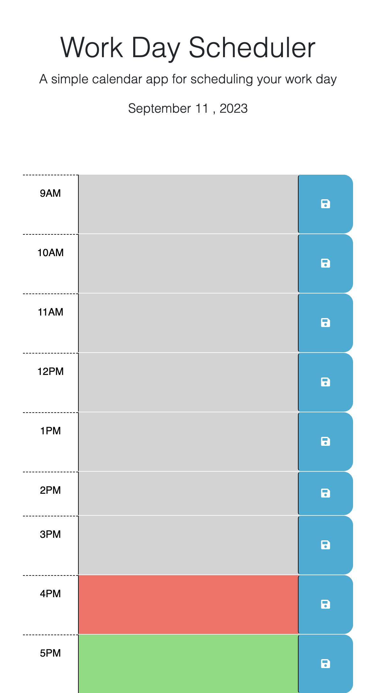

# Work Day Scheduler

## Description

The Work Day Scheduler is a simple web-based calendar application that allows users to manage their daily schedule effectively. It provides a dynamic interface for scheduling events during standard business hours (9am to 5pm) and utilizes local storage to persist the entered events.

## User Story

### As an employee with a busy schedule, I want to:

- Add important events to a daily planner.
- Easily view the current day.
- See time blocks for standard business hours (9am–5pm).
- Have time blocks color-coded to indicate past, present, or future events.
- Enter events by clicking into a time block.
- Save events using the save button for each time block.
- Ensure saved events persist even after refreshing the page.

## Technologies Used

- HTML
- CSS
- JavaScript
- jQuery
- Day.js

## Usage

- The current date is displayed at the top of the calendar.
- Scroll down to view time blocks for each hour from 9am to 5pm.
- Time blocks are color-coded to indicate whether they are in the past, present, or future.
- Click on a time block to enter an event for that hour.
- Click the save button to store the event in local storage.
- Saved events will persist even after refreshing the page.

## Screenshots

 
https://camsca.github.io/Proactive-workday-scheduler/
https://github.com/Camsca/Proactive-workday-scheduler
## Acknowledgments

- This project is based on starter code provided by [Xandromus](https://github.com/Xandromus).
- I contributed additional functionality to enhance the project.

